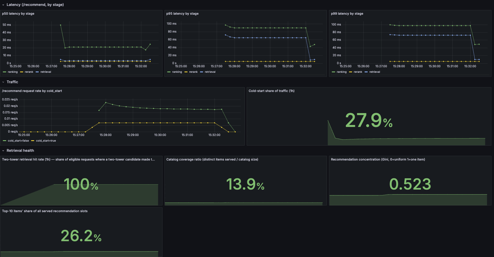
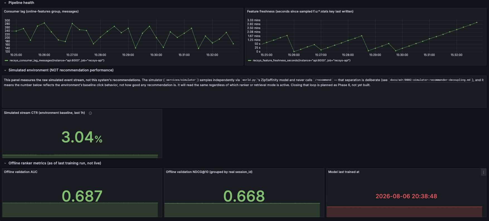
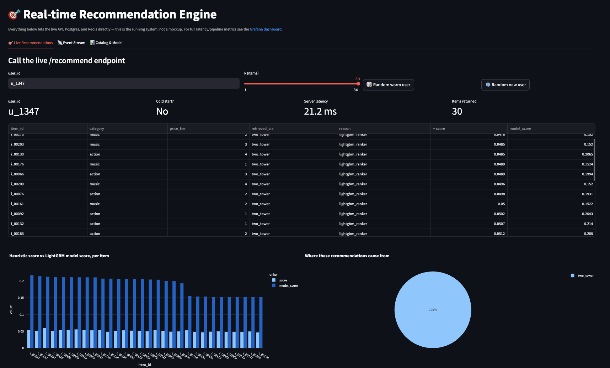
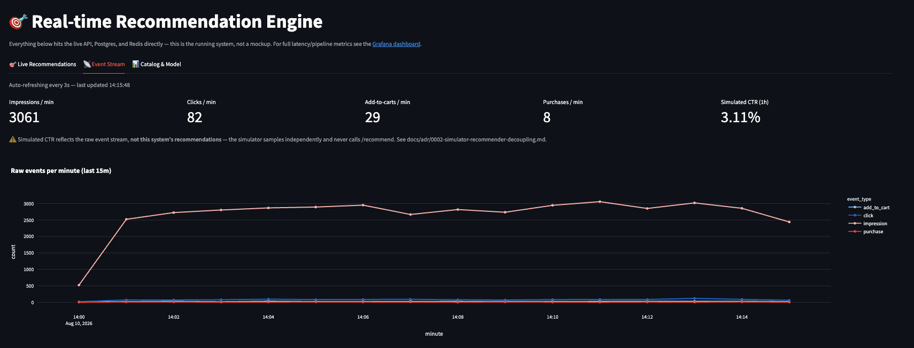

# Screenshots

Four screenshots of the running system, captured together in one session for
the same reason: numbers without the conditions they were measured under are
decoration, not evidence. Conditions stated here apply to all four unless a
caption says otherwise.

**Shared capture conditions**: Vultr `vc2-4c-8gb` (4 shared vCPU, 8GB RAM,
x86_64). Continuous synthetic load against `/recommend` at ~3 req/s, `k=30`,
roughly 20% of requests using never-seen user IDs (cold start). `api` running
`UVICORN_WORKERS=1`.

---

### `grafana_observability.png`

The main observability dashboard: `/recommend` latency by stage (p50/p95/p99
for retrieval/ranking/rerank), request rate split by `cold_start`, and
retrieval-health stats over the captured window — cold-start share of traffic
27.9%, two-tower retrieval hit rate 100% (expected under
`RETRIEVAL_MODE=two_tower_only`, where every warm-user candidate is two-tower
by construction), catalog coverage 13.9%, recommendation concentration
(Gini) 0.523, top-10 items' share of served slots 26.2%.

**Captured with `UVICORN_WORKERS=1`, and that's load-bearing, not incidental.**
The request-count and latency counters/histograms behind this dashboard
(`services/api/app/metrics.py`) live in per-process memory. With more than
one worker, each process keeps its own independent registry, so a given
Prometheus scrape lands on whichever worker answered it — counters jump
non-monotonically between scrapes and `rate()`/`increase()` over them
produce nonsense. This dashboard is only trustworthy at one worker for that
reason. **The p50/p95/p99 latency figures quoted in the README were measured
separately, with `UVICORN_WORKERS=4`** (a real production configuration, not
this one) — the two sets of numbers describe different deployments and are
not directly comparable.

---

### `grafana_pipeline_and_offline.png`

Pipeline health (consumer lag on the `online-features` group, feature
freshness) and the two lower rows: the simulated-environment panel and the
offline (training-time) ranker metrics.

The "Simulated environment" panel and its `3.04%` stream CTR are the raw
event stream's click rate, explicitly not this system's recommendation
performance — the simulator never calls `/recommend` (see
[ADR 0002](../adr/0002-simulator-recommender-decoupling.md)); the panel's own
text callout says so, and this caption isn't adding a claim the dashboard
doesn't already make.

**Offline validation AUC 0.687 and NDCG@10 0.668** are the post-IPW numbers
from [ADR 0004](../adr/0004-offline-metrics-vs-served-behavior.md) (0.6866 /
0.6681, shown here rounded to three places by the panel). They're read from
`models/ranker_metrics.json` at scrape time, not computed live — "Model last
trained at" (2026-08-06 20:38:48) is the last training run this figure
reflects, not the time of this screenshot.

---

### `streamlit_live_recommendations.png`

A live `/recommend` call for a warm user (`u_1347`, `cold_start: No`,
`k=30`), captured from the Streamlit showcase UI's "Live Recommendations"
tab. The point of this screenshot is the `model_score` column: distinct
values across the full served top-30 (visibly varying in the bar chart,
e.g. ranging roughly 0.152–0.214 across items shown), in place of the
two-value collapse that the position train/serve-skew bug produced before
the IPW fix (`SCORING_POSITION` — see ADR 0004).

**The table is sorted by the heuristic `score` column (`↑score`), not by
`model_score`** — that sort order is why `model_score` reads
non-monotonically top to bottom; it isn't noise or a rendering artifact, it's
a consequence of which column the UI is currently sorted on.

The `21.2ms` server-latency figure is this one request's measured time under
whatever concurrency happened to exist at that instant — a single sample, not
a distribution. For percentiles under the sustained ~3 req/s load described
above, see the latency-by-stage panels in `grafana_observability.png` (and
note those were captured at `UVICORN_WORKERS=1`, per that caption).

---

### `streamlit_event_stream.png`

The Streamlit showcase UI's "Event Stream" tab: the continuous synthetic
event stream feeding Redpanda and, via the sink, the offline Postgres store
— impressions/min, clicks/min, add-to-carts/min, purchases/min, and a raw
events-per-minute chart. This tab shows the producer/ingestion side only;
`/recommend` itself never touches Postgres or Kafka at request time — the
API serves entirely from Redis (`GET`/`HGETALL`, no aggregation in the
request path).

The counts shown (impressions/min 3061, clicks/min 82, add-to-carts/min 29,
purchases/min 8, simulated CTR 3.11%) are a live, auto-refreshing (every 3s)
rolling reading at the moment of capture, not a fixed system property — they
move with whatever traffic is running. As the panel's own on-screen warning
states, simulated CTR reflects the raw event stream, not this system's
recommendations, for the same reason as the previous screenshot
([ADR 0002](../adr/0002-simulator-recommender-decoupling.md)).
